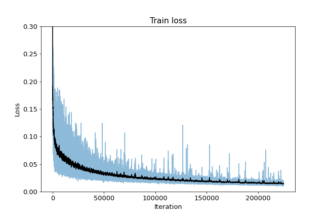
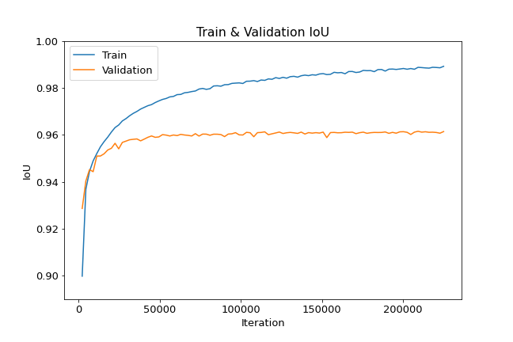

# UNet++
A PyTorch implementation of [UNet++: A Nested U-Net Architecture for Medical Image Segmentation](https://arxiv.org/abs/1807.10165) trained with CelebAMask

<p align="center">
  
</p>

## Dataset: CelebAMask
I made new datasets in Kaggle after pre-processing.  
1. Use only background for mask images
2. Downsize to [128x128](https://www.kaggle.com/datasets/kimjiyeop/celeba-128-onlybg) & [256x256](https://www.kaggle.com/datasets/kimjiyeop/celeba-256-onlybg)  

## Implementation Details
```
optimizer: Adam
learning rate: 3e-4 (without scheduler)
image size: 128x128
epoch: 100
batch size: 12

train loss: 0.5 * binary cross entrophy + dice coefficient loss
validation & test metric: IoU (Intersection over Union)
```

## Output of test images
<p align="center">
  
</p>

Some outputs are even better than target images in the dataset. 

## Train Loss
<p align="center">
  
</p>

## IoU
||Train|Valid|Test|
|:---:|:---:|:---:|:---:|
|# of images|27000|2500|500|
|IoU|0.9892</br>(Epoch 100)|0.9616</br>(Epoch 93)|0.9618|

<p align="center">
  
</p>

## Convert GIFs
<p align="center">
  
  
</p>
